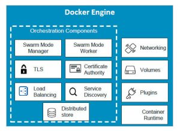

# Components

<table>
    <tr>
        <th> Docker engine </th>
        <th> Docker images </th>
        <th> Docker containers </th>
    </tr>
    <tr>
            <td>  </td>
            <td>  </td>
            <td>  </td>
        </tr>
    <tr>
        <td> docker deamon/ runtime</td>
        <td> template (manifest) </td>
        <td> shipping containers </td>
    </tr>
</table>
